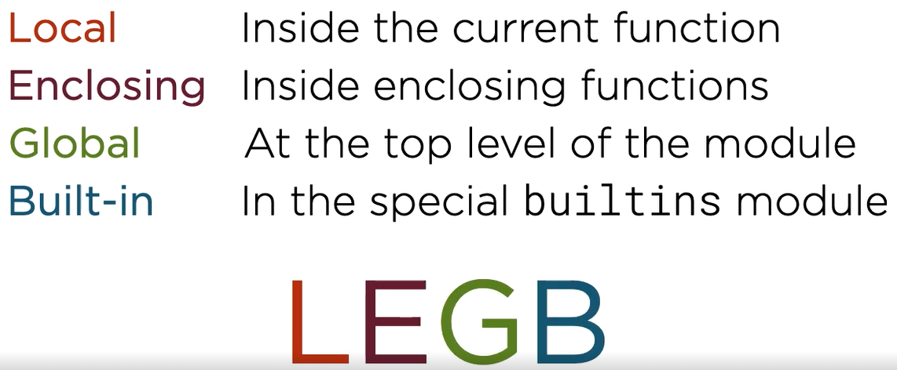
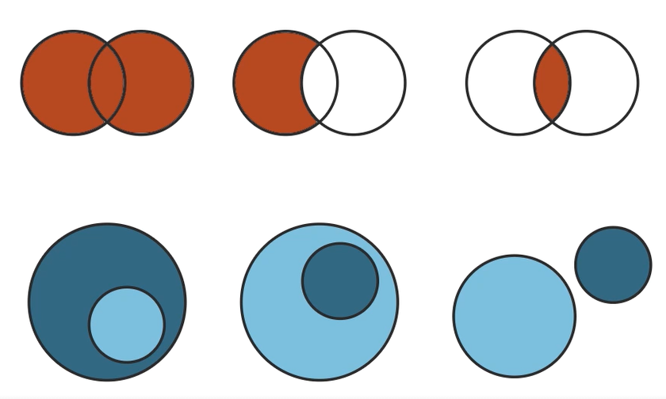

= Python Journey
:toc: left
:toclevels: 5
:sectnums:
:sectnumlevels: 5

NOTE: NOTE

TIP: TIP

IMPORTANT: IMPORTANT

CAUTION: CAUTION

WARNING: WARNING

[cols="1,3"]
|===
| Name | Description

| Asciidoctor
| Awesome way to write documentation

|===

== Memory

* Replication, Slicing, Protocols, Comprehensions, Class Invariant

== Python OOP : Four Pillars of OOP in Python 3 for Beginners Febin George

=== Section 3: Classes and Objects

*Self can be replaced with another keyword, but using self is convention*
----
class Employee:
    def employeeDetails(self):
        print(self)

employee = Employee()
employee.employeeDetails()
----

* @staticmethod is decorator: Decorator are function that take a functions and extends its functionality.

=== Section 6: Inheritance - The third pillar of OOP

* Similarly if you're making your members protected, what you're doing is you're sticking the sheet of paper inside your house. Now the people who have access to this information is only you and your family members.

* protected, which means to say that you're making them accessible only within your class and your derived class.

* Public => memberName, Protected => _memberName, Private => __memberName

=== Section 7: Polymorphism - The final pillar of OOP

== Practical Python for Beginners By Sarah Holderness

=== Course Overview

=== Data Types, Input, and Output

* Installing and using Visual Studio

== Core Python: Getting Started by Austin Bingham and Robert Smallshire

=== Classes

*Instance Initializers*

If you're coming from a Java C# or C++ background, it's tempting to think of dunder init as being the constructor. This isn't quite accurate. In Python, the purpose of dunder init is to configure an object that already exists by the time dunder init is called. The self argument is, however, analogous to this in Java, C#, or C++. In Python, the actual constructor is provided by the Python runtime system, and one of the things it does is check for the existence of an instance initializer and call it when present.

Python's everything‑is‑public approach can seem excessively open‑minded.

=== Introducing Strings, Collections, and Iteration

* String is Immutable
* Bytes: Encode / Decode
* List is Mutable
* Be aware that in Python versions prior to 3.7, the entries in the dictionary can't be relied upon to be stored in any particular order. As of Python 3.7, however, entries are required to be kept in insertion order.
* Python Raw String: `raw_string = r'c:\nc'`

=== Modularity

* If the python interpreter is running that module (the source file) as the main program, it sets the special __name__ variable to have a value “__main__”. If this file is being imported from another module, __name__ will be set to the module’s name. Module’s name is available as value to __name__ global variable.
* Any .py file constitues a Python Module
* Command Line Argument

----
import sys
url = sys.argv[1]
----

*Shebang*

=== Objects and Types

* Function arguments are transferred using pass-by-object-reference
* Scopes

* Everything is Python is object, including functions and modules.

=== Built-in Collections

* Tuple: Immutable sequence of arbitrary objects

----
myTuple = ()
print(myTuple)

# This is treated as Integer
myTuple = (1)
print(myTuple)

myTuple = (1,)
print(myTuple)

myTuple = (1,'2',"3")
print(myTuple)

myTuple = (1,2,['a','b'])
print(myTuple)
----

*String*

* Use str.join(), as + operator results in temporaries
* https://www.geeksforgeeks.org/python-string-join-method/

----
list1 = ['g','e','e','k', 's']
print("".join(list1))
----

* str.format()
** Too much to handle. Need to come here on need basis
** `"{0} How are you. How was your {1} interview".format('Naresh','LNT')`
* Enumerator
** If, for some reason, you need a counter, you should use the built‑in enumerate function, which returns an iterable series of pairs, each pair of being a tuple. The first element of the pair is the index of the current item and the second element of the pair is the item itself.

----
fruits = ['orange', 'apple', 'pear', 'banana']

for val in enumerate(fruits):
    print(val)

(0, 'orange')
(1, 'apple')
(2, 'pear')
(3, 'banana')
----

*List*

* Shallow copying

----
fruits = ['orange', 'apple', 'pear', 'banana']
print('id(fruits)=',id(fruits))

copyOfFruits = fruits[:]
print('id(copyOfFruits)=',id(copyOfFruits))

copyOfFruit2 = fruits.copy()
print('id(copyOfFruit2)=',id(copyOfFruit2))

copyOfFruit3 = list(fruits)
print('id(copyOfFruit3)=',id(copyOfFruit3))
----

*Set*

* Unordered collection of unique elements.
* Sets are mutable
* Elements in a set must be immutable

----
set1 = {10,20}
print(type(set1))

e = set([10,20])
print(e)
----

*Set Algebra*

=== Iteration and Iterables

*Comprehensions*

* Concise syntax for describing lists, sets and dictionaries.
* List Comprehension Syntax: [expr(item) for item in iterable]

----
myList = 'I really like this style of creating list'.split()
print(myList)

# Comprehension
print('--------------------')
l = [len(word) for word in myList]
print(l)
print(type(l))

#-----------------------------------------------------

mySet = set("this is fun way to create a list".split())
print(mySet)

setComprehension = {len(values) for values in mySet}
print(type(setComprehension))
print(setComprehension)

#-----------------------------------------------------

myDict = {"key1":"value1","user":"naresh"}

dictComprehension={len(key):len(key) for key in myDict}
print('----------')
print(dictComprehension)

----

=== Classes

----
class Flight:
    def __init__(self,name):
        self.name = name

    def fly(self):
        print('id(self)=',id(self))
        print('self.name=',self.name)
----

* Class Invariant: https://www.geeksforgeeks.org/what-is-class-invariant/

An invariant in Object-Oriented programming refers to some set of conditions or assertions that need to hold throughout the life of an object of a class. These assertions need to hold from the time the constructor is called for an object, at the end of each member (mutator) method call to the end of the destructor call. These conditions verify that an object’s behavior is justified during its lifetime and that the object maintains its well-defined state as intended. The invariant, however, need not hold true during the execution of a mutator method but must hold true at the end of it.

== Core Python: Classes and Object-orientation by Austin Bingham and Robert Smallshire

=== Class Attributes, Methods, and Properties

* This is because class blocks or blocks in general do not introduce new scopes in Python.